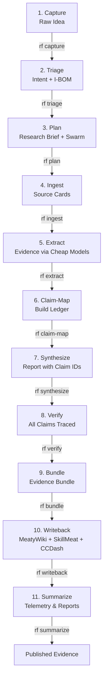

# The Research Pipeline

Research Foundry transforms raw ideas into auditable, claim-verified evidence bundles through an 11-step deterministic pipeline. This page visualizes the flow and maps each step to its `rf` command and output artifacts.

## Pipeline Flow

## Step-by-Step Reference

| Step | Command | Input | Output | Purpose |
|------|---------|-------|--------|---------|
| **1. Capture** | `rf capture TEXT` | Raw idea (text) | `inbox/raw_ideas/raw_*.md` | Record initial thought with metadata (source, sensitivity, tags) |
| **2. Triage** | `rf triage IDEA_PATH` | Raw idea file | `intents/active/<intent_id>.yaml` + `iboms/active/<ibom_id>.yaml` + `intenttree/nodes/<node_id>.yaml` | Convert idea → research intent + I-BOM + IntentTree node |
| **3. Plan** | `rf plan INTENT_ID` | Research intent | `runs/rf_run_YYYYMMDD_slug/{run.yaml, research_brief.md, swarm_plan.yaml, routing_decision.yaml}` | Scope the research: depth, audience, cost limit, freshness requirement; generate swarm plan |
| **4. Ingest** | `rf ingest SOURCE [--run RUN_ID]` | PDF, URL, doc, or notebook | `runs/rf_run_*/sources/src_*.md` | Normalize sources into Markdown cards with metadata |
| **5. Extract** | `rf extract RUN_ID [--model-profile PROFILE]` | Source cards | `runs/rf_run_*/extractions/ext_*.yaml` | Run cheap model profile to extract key claims, supporting facts, confidence scores |
| **6. Claim-Map** | `rf claim-map RUN_ID [--from extractions]` | Extraction cards | `runs/rf_run_*/claims/claim_ledger.yaml` | Build authoritative ledger: every claim gets a unique ID (`clm_NNN`), status, linked sources |
| **7. Synthesize** | `rf synthesize RUN_ID [--model-profile PROFILE]` | Claim ledger | `runs/rf_run_*/reports/report_draft.md` | Deep model synthesizes a report; may only cite existing claim IDs from ledger |
| **8. Verify** | `rf verify RUN_ID [--fail-on-unsupported]` | Report + claim ledger | `runs/rf_run_*/reviews/verification.yaml` | Scan every material claim in report; confirm each is either supported, labeled (inference/speculation/contradicted), or labeled unresolved |
| **9. Bundle** | `rf bundle RUN_ID [--verify]` | Run directory | `runs/rf_run_*/evidence_bundle.yaml` | Package sources, extractions, claim ledger, verified report, reviews, telemetry into durable archive |
| **10. Writeback** | `rf writeback RUN_ID [--targets meatywiki,skillmeat,ccdash]` | Evidence bundle | `runs/rf_run_*/writebacks/{meatywiki_writeback.md, skillbom_candidate.md, ccdash_event.yaml}` | Render writebacks and push to configured services (with optional review gate) |
| **11. Summarize** | `rf summarize [--period daily]` | Multiple runs / telemetry | CCDash summary report | Aggregate cost, token usage, verification outcomes across runs for observability |

## Key Invariants

- **Steps 1–6 are deterministic.** No API keys or network required by default. Cheap models, if used, run deterministically.
- **Step 7 (Synthesize) is where expensive models speak**, only inside the guardrail: cite claim IDs or label as inference/speculation.
- **Step 8 (Verify) enforces the claim policy.** Any unsupported material claim causes `rf verify` to exit with code 4 (fail the build).
- **Steps 9–11 are finalization.** Bundles are immutable snapshots; writebacks are audited.

## Running the Loop

See [Quickstart](../quickstart.md) for copy-pasteable commands and the demo loop.
